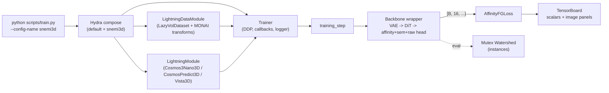

# nanocosmos

A PyTorch Lightning infrastructure for **spatially-coloured (nanocosmos-style)
instance segmentation** of 3-D connectomics volumes, adapted from the
`neurons` research codebase and built on top of NVIDIA's
Cosmos-Predict 2.5 / Cosmos 3 video-diffusion backbones (DiT + VAE).

> **First time here?**  Start with [`doc/INDEX.md`](doc/INDEX.md), which
> routes you to the right doc for the question you're asking.  TL;DR:
> [`STRUCTURE.md`](doc/STRUCTURE.md) for the file map,
> [`WALKTHROUGH.md`](doc/WALKTHROUGH.md) for what one batch actually
> does, [`GOTCHAS.md`](doc/GOTCHAS.md) when something goes silently
> wrong.

## Architecture at a glance



Three end-to-end backbones live under `nanocosmos/models/`:

- **`Cosmos3Nano3DWrapper`** — Cosmos 3 (Nano) 16B omni transformer; the
  shipped default backbone for the `snemi3d` recipe.
- **`CosmosPredict3DWrapper`** — Cosmos-Predict 2.5 (base DiT + Wan VAE);
  the flattened 2B baseline (`configs/cosmospredict3d.yaml`).
- **`Vista3DWrapper`** — SegResNetDS2 for fast local iteration.

All emit the same affinity + sem + raw head.  For the channel layout,
the loss, and the Mutex Watershed eval, see
[`doc/MUTEXWATERSHED.md`](doc/MUTEXWATERSHED.md).

## What it does

Every backbone trains one **affinity + sem + raw per-voxel head**
(`HEAD_CHANNELS = N_AFF + 2 = 16`):

| channels | field | meaning |
|---:|---|---|
| 0 .. N_AFF-1 (14) | `aff` | per-offset affinity logit for `P(label[v] == label[v+offset])` |
| N_AFF (1) | `sem` | foreground / boundary logit |
| N_AFF+1 (1) | `raw` | input-EM reconstruction (linear, L1; target in `[-1, 1]` with `vae_input_pm1`) |

The head emits **raw logits / linear values** (no activation in `forward`);
`sigmoid` is applied only at the loss, metrics, Mutex Watershed, and
TensorBoard boundaries.

The affinity offsets (`nanocosmos.losses.AFFINITY_OFFSETS`) are 3 **pull**
nearest-neighbours plus 11 **push** long-range offsets (anisotropy-aware
for EM).  `AffinityFGLoss` supervises the
affinities (masked BCE + soft-Dice + focal) directly against the binary
label-derived target; at evaluation / inference the predicted
affinities are agglomerated into instances by the **parameter-free
Mutex Watershed** (`nanocosmos.inference.mutex_watershed`, GPU or CPU).
See [`doc/MUTEXWATERSHED.md`](doc/MUTEXWATERSHED.md) for the full design,
the algorithm, and a worked example.

## Layout

The full file-by-file map lives in [`doc/STRUCTURE.md`](doc/STRUCTURE.md).
Skim of the top level:

```
nanocosmos/
├── configs/             Hydra configs (default → snemi3d → combine;
│                         nanocosmos-16B / nanocosmos-2B = joint SR+seg recipe)
├── nanocosmos/            importable package (losses, models, modules,
│                        datasets, datamodules, transforms, inference,
│                        preprocessors, metrics, visualizer, callbacks)
├── doc/                 STRUCTURE / ORGANIZATION / MUTEXWATERSHED / ARCHITECT
│                        / WALKTHROUGH / GOTCHAS / CONTRIBUTING / INDEX
├── scripts/             train.py entry point + dataset downloaders
├── tests/               pytest suite
├── pyproject.toml
└── requirements.txt     pinned lockfile (see top-of-file for usage)
```

## Install

```bash
pip install -e ".[cosmos,dev]"
```

## Train

```bash
# Plain SNEMI3D run:
python scripts/train.py --config-name snemi3d

# Multi-dataset (SNEMI3D + neurons + MICrONS) affinity training:
python scripts/train.py --config-name combine

# DDP, custom batch size:
python scripts/train.py --config-name combine data.batch_size=4 training.devices=4

# Example: train affinities only (drop the sem + raw aux heads).
python scripts/train.py --config-name combine loss.weight_sem.weight=0.0 loss.weight_raw.weight=0.0

# Joint super-resolution + segmentation (resolution-ladder recipe):
#   ssl (degraded->clean EM reconstruction) + sft (affinity + sem) on a
#   shared backbone via Joint3DReconSegLoss; see doc/JOINT_TRAINING.md.
python scripts/train.py --config-name nanocosmos-16B   # Cosmos-3 Nano backbone
python scripts/train.py --config-name nanocosmos-2B    # Cosmos-Predict 2.5 (2B)
```

### GPU memory: avoiding slow OOM drift on long runs

On long DDP runs (especially with `compile: max-autotune` or
`max_hard_pairs: 0`) the PyTorch caching allocator's reserved pool
tends to creep upward over hours even though live tensors are stable.
Two settings make the difference between "stable at 90 %" and "OOM at
epoch 30":

```bash
# 1.  Enable expandable allocator segments BEFORE launching python.
#     Mitigates fragmentation; near-zero runtime cost.  Read at CUDA
#     init, so it must be exported (cannot be applied in-process).
export PYTORCH_CUDA_ALLOC_CONF=expandable_segments:True

# 2.  Empty the cache around validation (callback already on by
#     default in snemi3d.yaml; turn on for custom configs):
#         callbacks.cuda_empty_cache_before_val: true
#     This now empties on BOTH sides of validation so the val-time
#     high-water mark does not stay reserved in the training pool.

python scripts/train.py --config-name snemi3d
```

Watch the trajectory in TensorBoard under the `cuda_memory/*` tags
(emitted by `CudaMemoryLoggerCallback`, on by default):

| Pattern                                                | Diagnosis                                                     |
|--------------------------------------------------------|---------------------------------------------------------------|
| `allocated_gb` flat, `reserved_gb` rising              | fragmentation — set `PYTORCH_CUDA_ALLOC_CONF` as above.       |
| `allocated_gb` and `reserved_gb` both rising           | tensor leak — inspect callbacks (image_logger, custom hooks). |
| sawtooth coupled to val epochs                         | val peak polluting train pool — enable the callback above.    |

## Loss

```python
from nanocosmos.losses import AffinityFGLoss, HEAD_CHANNELS, slice_head

loss_fn = AffinityFGLoss()
# head:      [B, 16, D, H, W]   (HEAD_CHANNELS)
# labels:    [B, D, H, W]
# raw_image: [B, 1, D, H, W]
out = loss_fn(head, {"labels": labels, "raw_image": raw_image})
# out -> {"loss", "loss/aff", "loss/sem", "loss/raw"}
fields = slice_head(head)  # {"aff", "sem", "raw"} views
```

## Tests

```bash
pytest tests/ -q
```

## Where to look first

| You want to ...                                                | Open                                                          |
| -------------------------------------------------------------- | ------------------------------------------------------------- |
| Skim the codebase before doing anything                        | [`doc/STRUCTURE.md`](doc/STRUCTURE.md)                        |
| Understand what one training batch actually does               | [`doc/WALKTHROUGH.md`](doc/WALKTHROUGH.md)                    |
| Know the head's channel layout, loss + Mutex Watershed         | [`doc/MUTEXWATERSHED.md`](doc/MUTEXWATERSHED.md)              |
| Know the backbone parameter budgets                            | [`doc/ARCHITECT.md`](doc/ARCHITECT.md)                        |
| Add a new dataset / loss / backbone / transform                | [`doc/CONTRIBUTING.md`](doc/CONTRIBUTING.md)                  |
| Debug a silent failure (head dropping, freeze schedule, ...)   | [`doc/GOTCHAS.md`](doc/GOTCHAS.md)                            |
| Tour all docs at once                                          | [`doc/INDEX.md`](doc/INDEX.md)                                |

## License

MIT.  See `LICENSE`.
