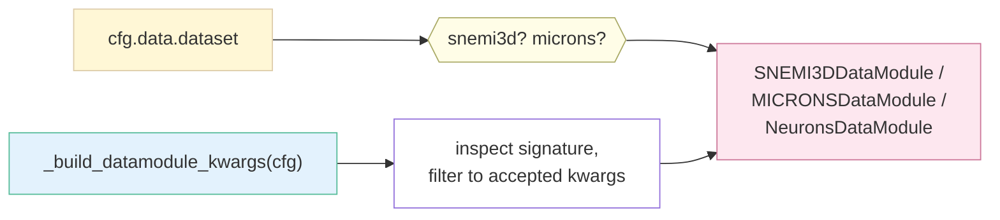
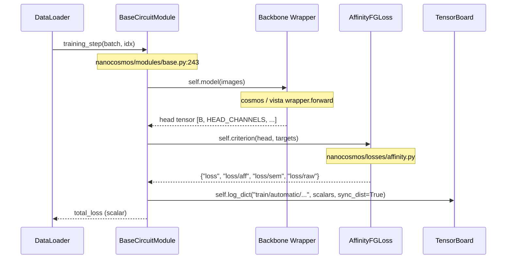

# Nanocosmos — End-to-end Walkthrough ("Follow One Batch")

> Audience: anyone who wants to understand how a single training step
> actually flows through nanocosmos, with file paths and line numbers so
> you can step through it in an editor.
>
> Companion docs:
> [`STRUCTURE.md`](./STRUCTURE.md) (file tree),
> [`ORGANIZATION.md`](./ORGANIZATION.md) (design patterns),
> [`ARCHITECT.md`](./ARCHITECT.md) (model parameter budgets),
> [`GOTCHAS.md`](./GOTCHAS.md) (silent failure modes).

This document follows what happens between

```bash
python scripts/train.py --config-name snemi3d
```

and the first scalar arriving in TensorBoard.  It is intentionally
verbose and cites file:line for every hop so you can switch between
this doc and the source code without losing your place.

---

## 0. The 30-second mental model

```mermaid
flowchart LR
    YAML["configs/<name>.yaml"]:::cfg --> CLI["scripts/train.py"]:::cli
    CLI -->|"build_datamodule"| DM["CircuitDataModule"]:::dm
    CLI -->|"build_module"| MOD["BaseCircuitModule\n(Vista3D / Cosmos3D)"]:::mod
    CLI -->|"setup_callbacks"| CB["ImageLogger,\nMemoryLogger,\nCheckpoint, ..."]:::cb
    CLI -->|"pl.Trainer.fit"| LOOP["Lightning Trainer Loop"]:::loop

    DM -.batch.-> LOOP
    LOOP -.training_step.-> MOD
    MOD --> WRAP["model wrapper\n(forward)"]:::wrap
    WRAP --> HEAD["affinity + sem + raw head\naff(N_AFF) | sem | raw"]:::heads
    HEAD --> LOSS["AffinityFGLoss"]:::loss
    LOSS --> METRICS["loss + Mutex Watershed\ninstance metrics"]:::metric
    METRICS --> TB[("TensorBoard /\nW&B logs")]:::tb
    CB -.|on_batch_end\non_epoch_end|.-> TB

    classDef cfg fill:#fff7d6,stroke:#dca,color:#333;
    classDef cli fill:#e3f2fd,stroke:#5b9,color:#333;
    classDef dm fill:#fde7ef,stroke:#c79,color:#333;
    classDef mod fill:#e8f5e9,stroke:#7a9,color:#333;
    classDef cb fill:#f3e5f5,stroke:#a7c,color:#333;
    classDef loop fill:#fffde7,stroke:#aa6,color:#333;
    classDef wrap fill:#e8f5e9,stroke:#7a9,color:#333;
    classDef heads fill:#fff,stroke:#aaa,color:#333;
    classDef loss fill:#fbe9e7,stroke:#c87,color:#333;
    classDef metric fill:#e1f5fe,stroke:#59a,color:#333;
    classDef tb fill:#ede7f6,stroke:#86c,color:#333;
```



Everything below zooms into one piece of this diagram.

---

## 1. CLI entry point

`scripts/train.py:main` (`@hydra.main` wrapper at line 537) is the only
entry point; everything else is called from it.

What happens, in order:

| Step | Lines      | Effect                                                                     |
| ---- | ---------- | -------------------------------------------------------------------------- |
| 1    | `538`      | `_install_runtime_patches()` — install `torch.load` allow-list + warning filters (see below). |
| 2    | `540-542`  | Print resolved YAML to stdout (good first-look sanity check).              |
| 3    | `544-548`  | Make a unique `outputs/<timestamp>_<name>/` run directory.                 |
| 4    | `550-552`  | `pl.seed_everything(seed, workers=True)`.                                  |
| 5    | `554-558`  | Build the **DataModule** via `build_datamodule(cfg)` — see §2.             |
| 6    | `560-569`  | Build the **Lightning Module** via `build_module(cfg)` — see §3.           |
| 7    | `571`      | Optional `torch.compile` on the **DiT backbone only** (avoids inference-mode tensors leaking into `backward` under DDP). |
| 8    | `573-579`  | Build callbacks, logger, profiler — see §4.                                |
| 9    | `581-588`  | Construct `pl.Trainer` via `build_trainer(...)`.                           |
| 10   | `592`      | `_resolve_checkpoint(cfg, module)` — pick **resume** or **weights-only** load. |
| 11   | `593-599`  | `run_fit_with_recovery(...)` wraps `trainer.fit(...)` and writes a `crash_recovery.ckpt` if anything throws. |
| 12   | `601-610`  | Save `final_model.ckpt` on rank 0.                                          |

`_install_runtime_patches()` (line `75`) is called explicitly from
`main` (no longer at import time) so `import scripts.train` from a
notebook or test does not silently mutate the global `torch` module
or warning filters.  Inside it:

* **`torch.load` allow-list / `weights_only=False` shim** — Lightning
  checkpoints pickle `defaultdict` / `OmegaConf` containers that the
  weights-only unpickler refuses even with `add_safe_globals`, so we
  force `weights_only=False`.  See [`GOTCHAS.md`](./GOTCHAS.md) #1.
* **Warning filters** — silence the noisier deprecation warnings from
  `torch.compile`, Lightning, MONAI.
* `torch.set_float32_matmul_precision("high")` to enable TF32 matmuls.

---

## 2. DataModule construction

`scripts/train.py:build_datamodule` (line 189):



Key decisions made here:

* `AffinityFGLoss` builds its targets in-module from the instance
  `label` (affinity + sem) and the input `image` (raw reconstruction),
  so the data path only needs to emit `image` + `label`.  The affinity
  stack is built on the GPU in the Lightning step, never in the loader.
  See [nanocosmos/datamodules/base.py](../nanocosmos/datamodules/base.py)
  for the MONAI pipeline assembly.
* `inspect.signature(cls).parameters` (line `217`) filters kwargs so
  older datamodule signatures don't `TypeError` on a new YAML knob.

The returned `CircuitDataModule` exposes `setup()` / `train_dataloader()` /
`val_dataloader()` / `test_dataloader()`; everything else is loaded
lazily.

---

## 3. Lightning module construction

`scripts/train.py:build_module` (line 222) maps `cfg.model.type` to
`CosmosPredict3DModule` / `CosmosTransfer3DModule` / `Cosmos3Nano3DModule`
/ `Vista3DModule` and forwards four config sub-dicts:

```python
return cls(
    model_config=model_cfg,        # network shape + freeze flags
    optimizer_config=...,           # AdamW lr, weight_decay, schedule
    loss_config=...,                # weight_aff / weight_sem / weight_raw
    training_config=...,            # mutex_watershed, gradient_clip_val, etc.
)
```

What `BaseCircuitModule.__init__` does
([nanocosmos/modules/base.py:122-157](../nanocosmos/modules/base.py)):

1. Stores `optimizer_config` / `training_config`; copies `loss_config`.
2. Calls `_build_model(model_config)` which by default forwards every
   key as a kwarg to `_model_cls`.  Cosmos overrides this in
   [modules/cosmos_transfer_2_5/base.py](../nanocosmos/modules/cosmos_transfer_2_5/base.py)
   to surface the freeze knobs and the `dit_backbone_lr` parameter group.
3. Constructs `self.criterion = self._loss_cls(**loss_config)`
   (`AffinityFGLoss`); a field with `weight: 0` is skipped in the
   forward and absent from the loss dict.
4. Builds the validation-time agglomerator
   `self.agglomerator = MutexWatershed(**training_config["mutex_watershed"])`
   (offsets / `n_pull` default to the loss's).
5. Initialises the per-epoch metric accumulator
   (`self._eval_accum`).

---

## 4. Callbacks

`scripts/train.py:setup_callbacks` (line 291) is a flat list of
"if `callbacks.<name>.enabled` then add it" guards.  The default set is:

| Callback                    | Source                                                            | Why                                                                  |
| --------------------------- | ----------------------------------------------------------------- | -------------------------------------------------------------------- |
| `CudaEmptyCacheCallback`    | `nanocosmos/callbacks/memory.py`                                    | Empty CUDA caching allocator before each val epoch.                  |
| `CudaMemoryLoggerCallback`  | same                                                              | Log allocated/reserved/fragmentation under `cuda_memory/*`.          |
| `ModelCheckpoint`           | Lightning                                                         | Save top-k by `val/automatic/loss`, plus `last.ckpt`.                |
| `EarlyStopping` (opt-in)    | Lightning                                                         | Disabled by default.                                                 |
| `LearningRateMonitor`       | Lightning                                                         | One scalar per param group per step.                                 |
| `ImageLogger`               | `nanocosmos/callbacks/tensorboard/image_logger.py`                  | The big one -- see §7.                                               |
| `RichProgressBar`           | Lightning                                                         | Prettier `tqdm`.                                                     |
| `ModelSummary(max_depth=2)` | Lightning                                                         | Module tree + parameter count at fit start.                          |

---

## 5. Inside `trainer.fit` — one training step

This is the part that runs **once per batch**, every step.



### 5.1 Where the head comes from

Every wrapper returns one tensor, not a dict of heads:

| Wrapper | Source | Output |
| ------- | ------ | ------ |
| Cosmos  | `decoder_adapter.head(decoder_features)` | `[B, HEAD_CHANNELS, D, H, W]` |
| Vista   | `head(backbone_features)`                | `[B, HEAD_CHANNELS, D, H, W]` |

Channel layout is owned by `nanocosmos.losses._common`:

| Field | Slice | Channels | Head output | Supervision |
| ----- | ----- | -------- | ----------- | ----------- |
| aff | `[0, N_AFF)` | `N_AFF` (14) | logit | masked logit-stable BCE + soft-Dice + focal vs `affinity_target_from_offsets` |
| sem | `[N_AFF, N_AFF+1)` | 1 | logit | Dice + BCE + Focal (`DiceBCEFocalLoss`) vs `labels > 0` |
| raw | `[N_AFF+1, N_AFF+2)` | 1 | linear | L1 reconstruction of the input EM (target in `[-1, 1]`) |

### 5.2 What `AffinityFGLoss` returns

`nanocosmos/losses/affinity.py:AffinityFGLoss.forward` returns a flat dict
whose keys sit next to the matching image panels emitted by the
`ImageLogger`:

```
loss            # scalar total (we backprop this)
loss/aff        # affinity composite
loss/sem        # foreground (semantic) composite
loss/raw        # raw reconstruction
```

(A field with `weight: 0` is skipped and absent from the dict.)
`loss/aff` accompanies the `pred/aff/{offset}` / `true/aff/{offset}`
panels, `loss/sem` the `pred/sem` panel, `loss/raw` the `pred/raw`
panel.  At eval the predicted affinities also feed the Mutex Watershed,
whose instances appear as `pred/label/{pre,mul}` and are scored under
`ins/metric/*`.

`BaseCircuitModule.training_step`
([nanocosmos/modules/base.py](../nanocosmos/modules/base.py)) prefixes
every key with `train/automatic/` and logs it, which is what
TensorBoard eventually sees.

### 5.3 Optimiser parameter groups

`nanocosmos/modules/base.py:configure_optimizers` (line 463) splits
parameters into `weight_decay` / `no_weight_decay` (norms + biases).
The Cosmos module overrides this in
[nanocosmos/modules/cosmos_transfer_2_5/base.py](../nanocosmos/modules/cosmos_transfer_2_5/base.py)
to surface three architecturally-distinct learning rates:

* `model.dit.*`        → `optimizer.dit_backbone_lr` (base DiT,
                          the "upper part" — typically frozen).
* `model.controlnet.*` → `optimizer.controlnet_lr` (residual branch;
                          defaults to `dit_backbone_lr` if unset).
* everything else      → `optimizer.lr` (heads, projector, decoder shim).

Each takes effect only when the corresponding submodule is unfrozen
(see §6).

---

## 6. Freeze flags (Cosmos only)

The Cosmos backbone exposes four independent freeze knobs:
`freeze_vae_encoder`, `freeze_dit_backbone`, `freeze_controlnet`,
`freeze_vae_decoder`.  Most are **bools** applied **once at construction**
by
[nanocosmos/models/cosmos_2_5_common/wrapper_base.py](../nanocosmos/models/cosmos_2_5_common/wrapper_base.py).
`freeze_dit_backbone` additionally accepts a non-negative **int `N`**: the
DiT is frozen for epochs `0..N-1` and thawed at the start of epoch `N`
(parsed by `_resolve_freeze_dit_backbone`; the thaw fires in
`BaseCosmosModule.on_train_epoch_start`).  See ARCHITECT §1.6 and GOTCHAS.

Cosmos-Transfer2.5 is a **base DiT + ControlNet** stack: the upstream
`nvidia/Cosmos-Transfer2.5-2B` repo holds the full base transformer on
revision `diffusers/general` and a small replicated control branch on
`diffusers/controlnet/general/{edge,depth,seg,blur}`.  Both are loaded
by `_try_load_diffusers` / `_try_load_controlnet`; the ControlNet's
`control_block_samples` are summed into the base DiT inside
`CosmosTransformerBlock.forward` (`hidden_states += controlnet_residual`).

* `freeze_*: true`  → that submodule is frozen (`requires_grad_(False)`)
  for the whole run; its parameters are excluded from the AdamW param
  groups in `configure_optimizers`.
* `freeze_*: false` → that submodule trains for the whole run;
  if it's the base DiT or the ControlNet, it is placed in its own param
  group with `lr = optimizer.dit_backbone_lr` /
  `optimizer.controlnet_lr` (each defaulting to `lr` if unset).

Defaults in `configs/snemi3d.yaml` (`cosmos3nano3d`, 16B Nano, no
ControlNet): VAE encoder frozen, **base DiT trainable**
(`freeze_dit_backbone: false`, full fine-tune under DDP), VAE decoder
frozen except the fine-tuning shim.  (The flattened `cosmospredict3d.yaml`
2B baseline uses an integer warm-up, `freeze_dit_backbone: 2`.)  See
[`ARCHITECT.md` §1.6](./ARCHITECT.md#16-freeze-flags--what-actually-moves)
for parameter-budget consequences.

---

## 7. ImageLogger — what produces the picture in TB

`nanocosmos/callbacks/tensorboard/image_logger.py:ImageLogger`.

Once per `every_n_epochs` (default 1), on rank 0 only:

1. `on_train_batch_end` / `on_validation_batch_end` cache the **first
   batch of the epoch** to CPU (`_detach_batch`).
2. At epoch end, `_run_visualization` moves the cached batch back to
   the device, runs a single eval-mode forward under autocast, casts
   predictions back to fp32.
3. `_log_predictions(...)` renders `true/{image,label}`, the
   `true/aff/{offset}` and `pred/aff/{offset}` affinity panels,
   `pred/sem`, `pred/raw`, and the Mutex Watershed instance
   segmentation `pred/label/{pre,mul}`.
4. Every tag is built through `TagContext.tag(panel)` so the resulting
   path is exactly `{stage}/{mode}/{panel}`.

This is why scalars and images for the same head cluster together in
TensorBoard's Images and Scalars tabs.

---

## 8. Validation step + Mutex Watershed

`BaseCircuitModule.validation_step` calls `_eval_step_and_accumulate`.
That function:

1. Forward the batch.
2. Apply `AffinityFGLoss` (validation loss).
3. Foreground metrics from `head[:, SEM_SLICE]` (`acc / iou / dice`).
4. **Agglomerate** the predicted affinities into a per-voxel instance
   ID map with `self.agglomerator(head[:, AFF_SLICE], fg)` (the Mutex
   Watershed), and score `ari / ami / voi / ted` against the GT
   instances.
5. On epoch end, all-reduce the accumulators across ranks and log them
   under `val/automatic/{sem,ins}/metric/{name}`.

The agglomerator is `nanocosmos/inference/mutex_watershed.py::MutexWatershed`
(parameter-free; see [`MUTEXWATERSHED.md`](./MUTEXWATERSHED.md)).

### 8.1 Val/test transform pipeline (deterministic)

`nanocosmos/datamodules/base.py::CircuitDataModule.get_val_transforms`
intentionally diverges from the train pipeline:

```
EnsureChannelFirst → [FindBoundaries(prob=1.0)]
→ [Pad + CenterCrop(patch_size)]   # or Resize(image_size)
→ instance_transforms (CC relabel, deterministic)
→ EnsureType
```

No `RandFlip`, no `RandRotate90`, no `RandTransposeXY`, no
`Rand3DElastic`, no `RandGaussianNoise`, no `RandAdjustContrast`.
The eval crops are deterministic (center crop) so the same volume
produces the same patch every epoch and the metrics are comparable
across runs.

---

## 9. Sliding-window inference (test/predict path)

When the test set has volumes too big to fit on the GPU,
`nanocosmos/inference/sliding_window.py:sliding_window_inference` is the
entry point.  It:

1. Iterates patch starts on a regular grid with a configurable overlap.
2. Forwards each patch through the wrapped model — input
   `[B, C_in, D, H, W]`, output `[B, HEAD_CHANNELS, D, H, W]`.
3. Accumulates patch outputs in a full-volume buffer with gaussian /
   average / max blending weights.
4. Normalises by the accumulated weight map and returns the final
   `[1, HEAD_CHANNELS, D_full, H_full, W_full]` tensor; downstream code
   slices it via `slice_head(...)` (`aff` / `sem` / `raw`) and runs the
   Mutex Watershed on the affinities to get instances.

`scripts/train.py` does **not** call this path; it's invoked from
`trainer.test(...)` and from notebook code that wants an offline
prediction map.

---

## 10. Where to look for what

| Curious about ...                 | Read first ...                                                                  |
| --------------------------------- | ------------------------------------------------------------------------------- |
| Augmentation order                | `nanocosmos/datamodules/base.py::CircuitDataModule.get_train_transforms`          |
| Loss + affinity targets           | `nanocosmos/losses/affinity.py::AffinityFGLoss` + `affinity_target_from_offsets` in `_common.py` |
| Channel layout (aff/sem/raw)      | `nanocosmos/losses/_common.py::HEAD_LAYOUT`                                       |
| TensorBoard tag layout            | `nanocosmos/callbacks/tensorboard/tags.py::TagContext` + `heads.py::_log_predictions` |
| Freeze flags                      | `nanocosmos/models/cosmos_2_5_common/wrapper_base.py`                            |
| Param-group split                 | `nanocosmos/modules/cosmos_2_5_common/base.py::configure_optimizers`             |
| Mutex Watershed agglomeration     | `nanocosmos/inference/mutex_watershed.py` ([`MUTEXWATERSHED.md`](./MUTEXWATERSHED.md)) |
| Adding a new dataset/head/...     | [`CONTRIBUTING.md`](./CONTRIBUTING.md)                                          |
| Silent failure modes              | [`GOTCHAS.md`](./GOTCHAS.md)                                                    |
| Parameter budgets                 | [`ARCHITECT.md`](./ARCHITECT.md)                                                |
| File tree                         | [`STRUCTURE.md`](./STRUCTURE.md)                                                |
| Design patterns                   | [`ORGANIZATION.md`](./ORGANIZATION.md)                                          |
